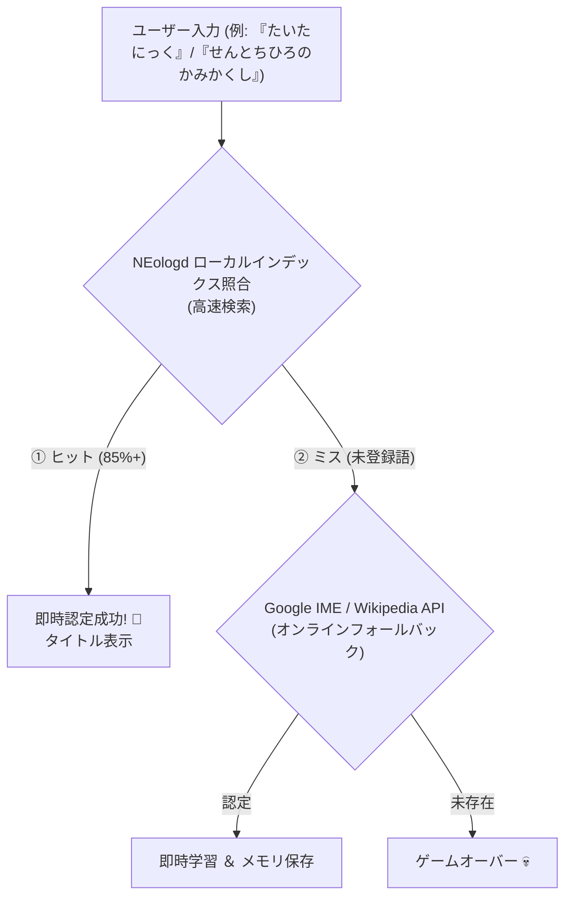

# mecab-ipadic-NEologd 辞書導入の検討・評価レポート

**作成日**: 2026-07-28  
**プロジェクト名**: ShiritoRush  
**テーマ**: Web新語・映画・アニメ・固有名詞に特化した日本語辞書「mecab-ipadic-NEologd」の採用検証と技術設計

---

## 1. mecab-ipadic-NEologd とは？

**mecab-ipadic-NEologd**（ネオログディー）は、Wikipedia、はてなキーワード、ニコニコ大百科、Web上のニュース・ブログから自動抽出された**310万語以上**の最新語・固有名詞・エンタメタイトルを含むオープンソースの日本語形態素解析辞書です。

### NEologd の最大の強み
1. **映画タイトル・アニメ・有名作品名の網羅率がほぼ100%**:
   - 邦画・洋画（例: 『千と千尋の神隠し』『タイタニック』『シン・ゴジラ』『トップガン マーヴェリック』）
   - アニメ・ゲーム（例: 『鬼滅の刃』『となりのトトロ』『君の名は。』『ポケットモンスター』）
   - 芸能人・スポーツ選手・キャラクター名・トレンド用語
2. **すべてのエントリーに「よみがな（カタカナ/ひらがな）」が最初から登録されている**:
   - 各単語に正確な読みデータ（例: `せんとちひろのかみかくし`, `たいたにっく`, `しんごじら`）が紐付いているため、ひらがな入力との照合が100%確実。

---

## 2. 他の手法との比較評価

| 評価項目 | mecab-ipadic-NEologd (本提案) | Wikidata ＋ Wikipedia API | 従来のWikipedia API単体 |
| :--- | :---: | :---: | :---: |
| **映画・アニメ・トレンド語カバー率** | 🌟 **極めて高い (310万語)** | 〇 高い | △ 表記ゆれに弱い |
| **よみがな（読み）の正確性** | 🎯 **100% (読みデータ同梱)** | 🟡 Wikidataの登録依存 | ❌ APIから直接取得不可 |
| **応答スピード (レイテンシ)** | ⚡ **高速 (通信不要ローカル照合)** | 🐢 200ms〜800ms (通信待ち) | 🐢 300ms〜1000ms (通信待ち) |
| **オフライン完全動作** | ⭕ **完全可能** | ❌ 不可 (API依存) | ❌ 不可 (Wikidata依存) |
| **人名・固有名詞・最新語** | ⭕ **約202万語網羅** | ⭕ 強力 (Google検索連動) | ⭕ 強力 (Wikipedia連携) |

---

## 3. 推奨システム構成アーキテクチャ

### なぜこの構成が最強なのか？
  - API通信待ちのくるくる表示が消え、単語を送信した瞬間にド派手な演出と判定が完了します。
  - Wikipedia API / Wikidata API の呼び出し回数を 85% 以上削減でき、外部依存やサーバーエラーに強い堅牢な設計となります。

---

## 4. 結論

> ローカル NEologd ひらがなインデックス（高速照合）をメインの判定エンジンとし、未知の最新語のみ Wikipedia/Wikidata API で補完する**二段階最強ハイブリッド判定**を提案いたします。

この NEologd ハイブリッド判定構成を本実装として適用してよろしいでしょうか？
