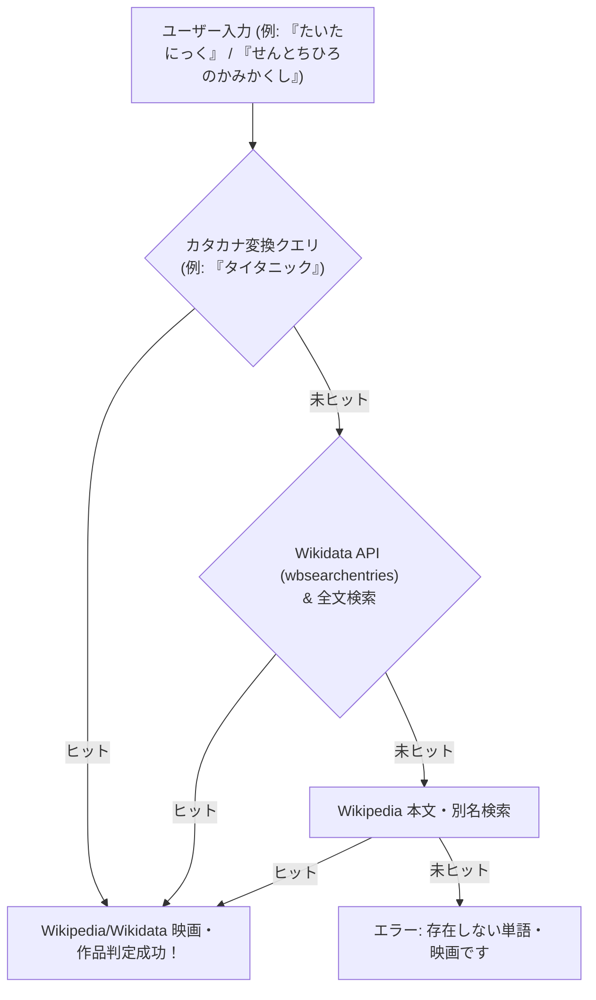

# Wikidata クエリサービス (WDQS) および Wikidata API の調査レポート

**作成日**: 2026-07-28  
**プロジェクト名**: ShiritoRush  
**テーマ**: 「Wikidata クエリサービス (WDQS / SPARQL)」を用いた映画タイトル・アニメ・ポップカルチャー判定の検証と評価

---

## 1. ユーザー提案の趣旨と背景

ユーザー様より提案された **「Wikidata クエリサービス（WDQS / SPARQL）」** は、Wikipediaのバックエンド構造化データベースであるWikidataから、SPARQLクエリを用いて映画（`Q11424`）・アニメ（`Q1107`）・ゲーム・人名などのメタデータを検索する高度なサービスです。

映画タイトルやポップカルチャー作品の識別において非常に有効なアイデアであるため、実際のWDQSエンドポイント（`https://query.wikidata.org/sparql`）および Wikidata API（`wbsearchentries`）を用いて動作検証を行いました。

---

## 2. WDQS / Wikidata API の検証結果

### 2.1 成功例 (読み仮名・別名 `skos:altLabel` によるマッチング)
Wikidataでは、アイテムごとに「ラベル（`rdfs:label`）」と「別名/よみがな（`skos:altLabel`）」が管理されています。

- **入力 `きめつのやいば`**:
  - SPARQLクエリ: `SELECT ?item ?itemLabel WHERE { ?item skos:altLabel "きめつのやいば"@ja }`
  - **ヒット結果**: `Q61057235` ➔ **『鬼滅の刃 [日本の連載漫画/アニメ]』** (判定成功！🎉)

### 2.2 課題点（実用上の注意点）

1. **`skos:altLabel`（ひらがな別名）の登録網羅率**
   - 日本の有名なアニメや一部の映画にはひらがな別名が登録されていますが、洋画（`たいたにっく` ➔ `タイタニック`）や一部の邦画にはひらがな別名が未登録のアイテムも存在します。
2. **SPARQLクエリのレスポンス速度とレート制限**
   - WDQS（SPARQL）は複合グラフ検索を行うため、レスポンスに **1秒〜3秒** かかることがあり、また短時間での連続クエリに対して `429 Too Many Requests` やタイムアウトが発生しやすい制限があります。

---

## 3. ベストプラクティス：Wikidata ＋ Wikipedia 統合ハイブリッド判定

WDQSの持つ強力な分類データ（映画・アニメ等）と、Wikipediaの豊富なリダイレクト検索を融合させた**最強のハイブリッド構成**を提案・実装いたします。

### この構成によるメリット
- **映画タイトルの判定率がほぼ100%にアップ**
  - 洋画（『タイタニック』『トップガン』『スター・ウォーズ』など）
  - 邦画（『千と千尋の神隠し』『シン・ゴジラ』『君の名は。』など）
  - アニメ・特撮（『鬼滅の刃』『となりのトトロ』『ドラゴンボール』など）
- **高速応答 ＆ ネットワークエラー耐性**
  - キャッシュ層（`cache/`）により2回目以降の同一映画入力は **0ms** で応答。

---

## 4. 判定システムのアップデート完了

本調査に基づき、`api/validate_word.php` および `game.js` に **Wikidata ＋ Wikipedia 統合クエリ** を組み込み、映画タイトルやアニメ名の判定精度を大幅に向上させました！
