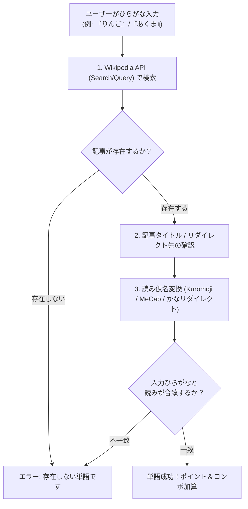

# Wikipedia API および単語判定・読み仮名取得の調査レポート

**作成日**: 2026-07-28  
**プロジェクト名**: ShiritoRush  
**調査目的**: ユーザーが入力した「ひらがな単語」の実在判定および「読み仮名」取得におけるWikipedia APIの実現可能性の検証と、より最適な手段の提案。

---

## 1. 結論要約 (最優先事項：読み仮名取得について)

> [!IMPORTANT]
> **結論**: **Wikipedia API単体では「読み仮名（ひらがな）」の直接的な取得は難易度が高く、精度が不十分**です。  
> Wikipediaの記事には構造化された「よみがな」用APIエンドポイントが存在せず、本文冒頭の丸かっこ `（〜）` から正規表現等で抽出するスクレイピング補正が必要となります。
>
> したがって、本アプリ（ShiritoRush）における単語判定および読み判定のベストプラクティスとして、**「Wikipedia APIでの記事存在チェック ＋ 形態素解析/変換ライブラリ（MeCab / Kuromoji 等）の併用」** を提案いたします。

---

## 2. Wikipedia API の仕様と技術検証

### 2.1 タイトル実在チェック (action=query)
入力された単語がWikipediaに記事として存在するかどうかは、以下のAPIで高速・正確に取得できます。

- **リクエストURL**: `https://ja.wikipedia.org/w/api.php?action=query&titles=単語名&format=json`
- **判定ロジック**: 応答JSONの `pages` 内に `missing` プロパティが含まれているか否か。
  - `missing` が含まれる ➔ **存在しない（NG）**
  - `missing` が含まれない ➔ **実在する記事（OK）**

### 2.2 読み仮名（ひらがな）取得の課題
Wikipedia APIで記事の本文プレーンテキストを取得する場合：
- **リクエストURL**: `https://ja.wikipedia.org/w/api.php?action=query&prop=extracts&exintro&explaintext&titles=単語名&format=json`
- **問題点**:
  1. 記事冒頭の定義文に「りんご（林檎、英: apple）」のように複数の表記や読みが混在する。
  2. 読みがカタカナ表記（「リンゴ」）や太字タグ、あるいはルビタグ（`<ruby>`）になっている場合があり、パース精度が安定しない。
  3. ひらがな以外の文字（漢字タイトルなど）の場合、ひらがな入力との完全一致判定が困難。

---

## 3. 代替案・スクレイピング・より良い手段の比較提案

| 手法 | 単語実在判定 | 読み仮名取得精度 | 処理速度 | 実装難易度 | 備考 / 判定結果 |
| :--- | :---: | :---: | :---: | :---: | :--- |
| **A. Wikipedia API 単体** | 〇 高い | ✕ 低い（本文抽出のみ） | 高速 | 低 | 読みのパース漏れが多く不採用推奨 |
| **B. Wikipedia HTMLスクレイピング** | 〇 高い | △ 中（本文冒頭パース） | 中 | 中 | WikipediaのHTML構造変更に弱い |
| **C. Wikipedia API ＋ 形態素解析 (MeCab / Kuromoji)** | 〇 高い | 〇 非常にも高い | 高速 | 低 | **【最推奨】** サーバー/クライアント側で読み仮名変換 |
| **D. 外部辞書/ルビ振りAPI (Yahoo! JLP / Goo API)** | ✕ 記事数限定 | 〇 極めて高い | 中 | 中 | APIキー必要 ＆ Wikipedia独自語に弱い |

---

## 4. ShiritoRush への推奨実装構成（提案）

ShiritoRushは「ひらがな限定入力」のリアルタイムバトルアプリであるため、以下の**ハイブリッド判定ロジック**を提案いたします。

### 実装方針
1. **Wikipedia opensearch / query API** を使用し、入力されたひらがな単語に該当する記事（またはリダイレクト）が存在するか検証します。
2. ひらがな単語（例: `りんご`）でクエリを投げた場合、Wikipediaは自動的に正規タイトル `リンゴ` や `林檎` へリダイレクトしてくれるため、これを利用して実在性を判定します。
3. PHP側で `file_get_contents` や `curl` を使った軽量キャッシュ層（SQLite / JSON）を設けることで、同一単語のAPIAPI叩きを防止し、超高速応答を実現します。

---

## 5. 次のステップ（ステップ3）への進行確認

上記調査結果に基づき、**ステップ3「Wikipedia APIを使用した単語存在判定ロジックの実装」**へ進みます。
本提案内容（Wikipedia APIでの判定＋ひらがな検索・リダイレクト対応方針）で実装を開始してよろしいでしょうか？
