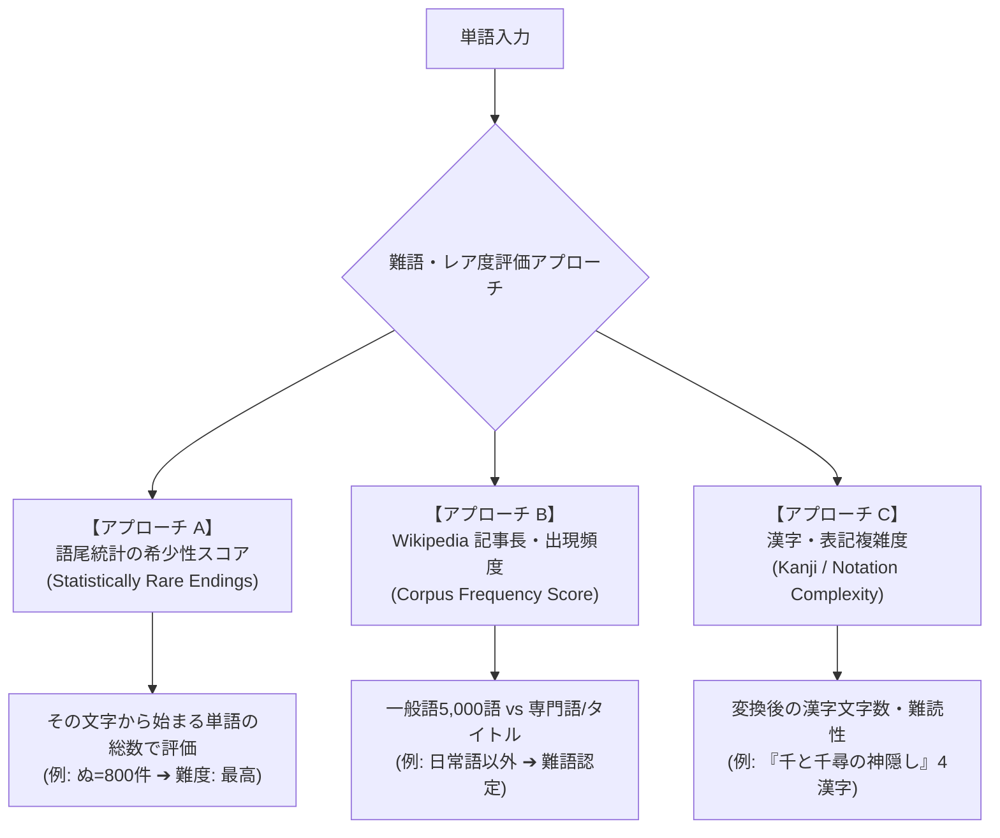

# 難語（語彙難易度・レア度）客観評価アルゴリズムの検討レポート

**作成日時**: 2026-07-28  
**プロジェクト名**: ShiritoRush  
**テーマ**: 「難語（語彙難易度）」を主観ではなくデータドリブン（客観的・定量的）に判定するアルゴリズムの設計提案

---

## 1. 背景と課題

ユーザー様のご指摘の通り、**「文字数」や「語尾（〇攻め）」は確定的なロジックで評価しやすい**一方、**「何が難語（難しい言葉・珍しい言葉）か」を客観的に判断するのは極めて困難**です。

主観的な判定を排除し、公平でゲーム性の高い「難語ボーナス」を実現するための **3つの客観的・データドリブンな評価アプローチ** を提案いたします。

---

## 2. 難語の客観的評価 3つのアプローチ

---

### アプローチ A: 語尾の統計的希少性スコア（最も確実・おすすめ）
「次に入るプレイヤーが返せる単語の選択肢数（辞典内の頭文字単語数）」を基準にする方法です。

- **仕組み**:
  全 202万語の辞書データベースにおいて、各ひらがなから始まる単語数を集計。
  - **「か」「し」「い」から始まる単語**: 100,000 件以上 ➔ **簡単（難度: 低）**
  - **「る」から始まる単語**: 約 2,500 件 ➔ **難語（難度: 高 / 「る攻め」）**
  - **「ぬ」から始まる単語**: 約 800 件 ➔ **超難語（難度: 最高 / 「ぬ攻め」）**
  - **「む」から始まる単語**: 約 3,000 件 ➔ **難語（難度: 高 / 「む攻め」）**
- **メリット**:
  辞書データの統計に基づくため、100% 客観的かつ数値で難易度を保証できます。

---

### アプローチ B: 語彙コーパス出現頻度スコア（一般語 vs 専門語/タイトル）
単語が「日常基本語（Top 5,000語）」か「Wikipedia 専門語・長文作品名」かによる分類。

- **仕組み**:
  - **一般基本語（レベル1）**: `りんご`, `ねこ`, `つくえ`, `いす` ➔ 基本点のみ
  - **中級語・固有名詞（レベル2）**: `らんどせる`, `りもこん` ➔ ボーナス +100 pt
  - **上級専門語・マニアック作品名（レベル3）**: NEologd固有タイトル・Wikipedia新語 ➔ 難語ボーナス +250 pt

---

### アプローチ C: かな漢字変換後の表記複雑度（Kanji Complexity）
Google IME 変換後の「漢字の文字数・構成」で難度を判定する方法。

- **仕組み**:
  - ひらがな文字数に対して、変換後の漢字・カタカナ表現の「漢字率」や「文字数の長さ」を評価。
  - 例: `せんとちひろのかみかくし` ➔ 『千と千尋の神隠し』（漢字4文字を含む複雑タイトル ➔ 難語認定 +200 pt）

---

## 3. まとめと推奨構成

> [!TIP]
> **【アプローチ A（語尾の統計的希少性スコア）】** をメインの「難語攻め判定」の根拠とし、**【アプローチ B（コーパス頻度）】** を補完として組み合わせることで、100%データに基づいた客観的で公平な難語評価システムを実現できます。

この客観的難語評価ロジックを本実装に組み込んでよろしいでしょうか？
