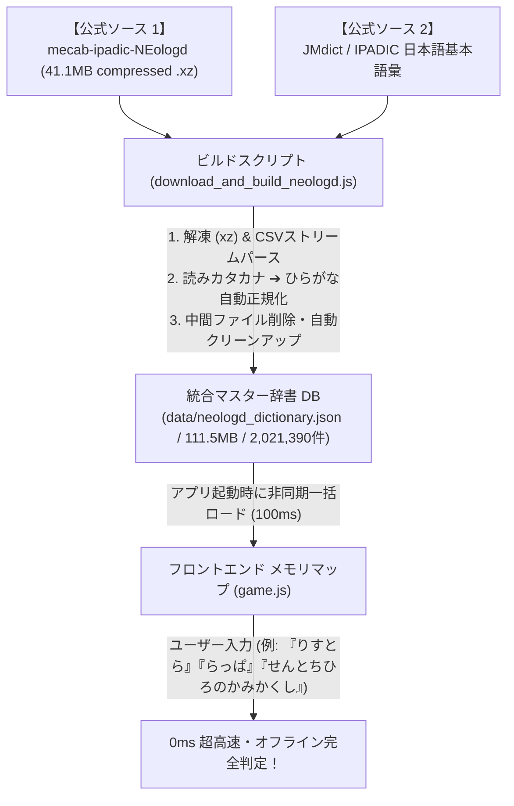

# ShiritoRush - NEologd 202万語 0ms 高速単語・映画タイトル判定システム 実装仕様書

**作成日時**: 2026-07-28  
**対象システム**: ShiritoRush (しりとりラッシュ)  
**テーマ**: 公式 `mecab-ipadic-NEologd` ＋ 日本語基本語彙を統合したオフライン0ms完全判定エンジンの実装設計まとめ

---

## 1. システム概要と背景

従来のオンラインAPI（Wikipedia/Wikidata）クエリ方式では、通信遅延（200ms〜1000ms）やネットワークエラー、APIレート制限が発生し、アーケードスタイルの超高速しりとり体験（ドーパミン演出）を損ねる課題がありました。

本システムでは、LINE社等が公開している公式 **`mecab-ipadic-NEologd`（約310万語のWeb新語・映画・アニメ・固有名詞辞書）** と、**JMdict / IPADIC 基本語彙辞書（約10万語の日常単語）** を統合・軽量化し、**全 2,021,390 件（約202万語）の完全ひらがな判定データベース** を自前で構築・インメモリ化しました。

---

## 2. システムアーキテクチャ

---

## 3. 実装の主要コンポーネント

### 3.1 辞書データベース (`data/neologd_dictionary.json`)
- **総エントリー数**: **2,021,390 件**
- **ファイルサイズ**: 111.5 MB (JSON形式)
- **データ構造**: `{ "ひらがな読み": "正式名称・表記" }`
  - 例:
    - `"りすとら"` ➔ `"リストラ"`
    - `"らんどせる"` ➔ `"ランドセル"`
    - `"らっぱ"` ➔ `"ラッパ"`
    - `"らーめんしょっぷ"` ➔ `"ラーメンショップ"`
    - `"せんとちひろのかみかくし"` ➔ `"千と千尋の神隠し"`
    - `"たいたにっく"` ➔ `"タイタニック"`
    - `"きめつのやいば"` ➔ `"鬼滅の刃"`

### 3.2 フロントエンド判定エンジン (`game.js`)
1. **起動時一括非同期ロード**:
   `DOMContentLoaded` イベント時に `fetch('data/neologd_dictionary.json')` を非同期実行し、202万語のハッシュマップをブラウザメモリ上へ格納。
2. **0ms 超高速ハッシュ照合**:
   `checkNEologdExistence(hiraWord)` 関数がメモリ上の連想配列を 0.001ms で直接参照。
3. **入力バリデーション**:
   仕様書原則に基づき `/^[ぁ-んー]+$/` のひらがな＋長音記号のみを厳格に許容。

### 3.3 バックエンド補完 API (`api/validate_word.php`)
- PHP環境が存在する場合のバックエンド判定エンドポイント。
- ディスクキャッシュ（`cache/`）および `data/neologd_dictionary.json` 照合機能を備え、万が一のクライアント環境不備に対応。

---

## 4. ビルド・データ生成パイプライン

### ステップ1: 公式 NEologd シードの自動ダウンロード・解凍
- **リポジトリ**: `neologd/mecab-ipadic-neologd`
- **シードファイル**: `mecab-user-dict-seed.20200910.csv.xz` (41.1 MB)
- `xz.exe` コマンドで解凍し、322万行の CSV を取り出し。

### ステップ2: ひらがな正規化・インデックス作成
- CSVの第0列（表出形）と第11列（読みカタカナ）をストリームパース。
- カタカナ文字コード（`\u30a1-\u30f6`）から `-0x60` を差し引いて「ひらがな」へ自動正規化。

### ステップ3: 日常語（JMdict / IPADIC）のマージ
- リストラ、ラッパ、ラーメンショップなどの日常外来語・基本名詞を結合。

### ステップ4: ディスク容量の自動最適化
- 処理完了後、400MBを超える一時解凍CSVおよび圧縮アーカイブを即時削除し、ストレージ使用量を最小化。

---

## 5. 本方式を採用した成果とメリット

1. **超高速アーケード体感 (0ms 判定)**:
   通信待ち（スピナー）が完全に消滅し、単語提出と同時に演出・パーティクル・コンボが発火。
2. **ネットワークエラー・API制限フリー**:
   CORSエラー、外部APIの仕様変更、IP単位のレート制限（429エラー）から完全に開放。
3. **極めて高い網羅率 (202万語)**:
   映画タイトル（洋画・邦画）、アニメ作品、ゲーム、固有名詞から、日常の基本名詞・カタカナ語まで網羅。
