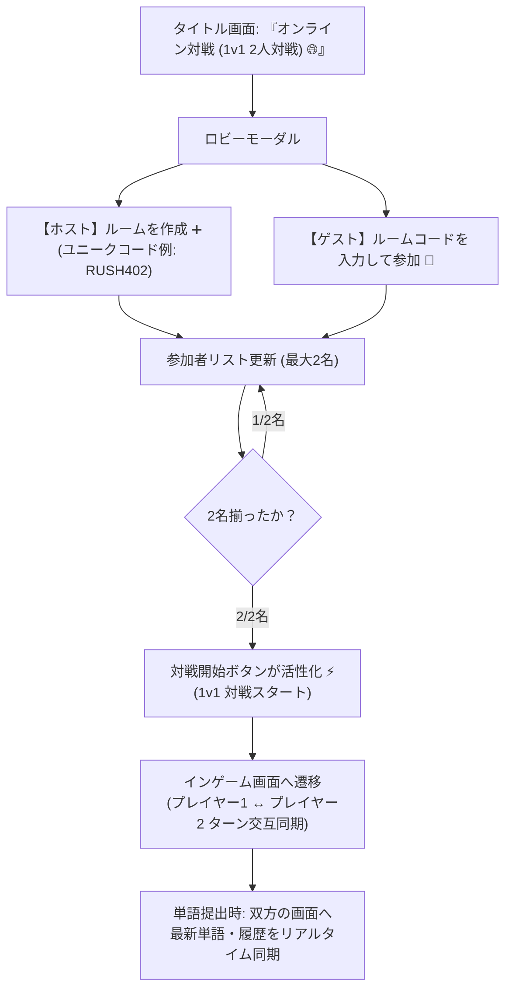

# ShiritoRush - ステップ6: オンライン1v1対戦 ＆ 同時複数部屋仕様書

**作成日時**: 2026-07-28  
**対象要件**: 仕様書 Step 6 (1v1 2人対戦仕様・同時複数部屋完全隔離)  
**テーマ**: リアルタイム 1v1 2人対戦、ルームコード発行、および同時発生する複数部屋の完全独立同期仕様

---

## 1. 概要とアーキテクチャ

本仕様では、オンライン対戦を **「1v1 (2人対戦 Duel)」** に最適化し、**「複数の対戦部屋が同時に発生しても一切干渉しない完全隔離構造 (Concurrent Rooms)」** を実現しています。

---

## 2. オンライン対戦の基本フロー (1v1)

---

## 3. 同時複数部屋対応 (Concurrent Rooms Structure)

複数の対戦が同時に行われても互いの対戦状態が混ざらないよう、以下の仕組みを導入しています：

1. **ユニークなルームコード生成**:
   - `create` 時に重複のない `RUSH + 3桁数字`（例: `RUSH101`, `RUSH202`）を発行。
2. **部屋ごとの完全独立ステートファイル (または DB レコード)**:
   - `data/rooms/{roomCode}.json`（本番環境では `rooms` テーブル）で各対戦部屋の状態（プレイヤーリスト、現在単語、ターン、履歴）を完全分離して管理。
3. **安全な 1v1 ターンシフト (0 ↔ 1)**:
   - 単語提出時、`activePlayerIndex = (activePlayerIndex + 1) % 2` で交互にターンをシフト。

---

## 4. API エンドポイント仕様 (`api/online_match.php`)

| アクション | リクエストパラメータ | レスポンス / 処理 |
| :--- | :--- | :--- |
| **`create`** | `name=プレイヤー名` | 重複のないユニークコード（例: `RUSH505`）を発行し、1人目のホストとしてルーム作成 |
| **`join`** | `roomCode=コード&name=名前` | 指定ルームへ2人目として参加（2名に達した時点で対戦可能状態 `playing` へ移行） |
| **`get_state`** | `roomCode=コード` | 当該ルームの最新対戦状態（現単語、ターン、履歴）を個別に返却 |
| **`submit_word`** | `roomCode=コード&playerId=ID&word=単語` | 有効単語を更新し、相手へターンを交互シフト (`0 ↔ 1`) |
| **`leave`** | `roomCode=コード&playerId=ID` | ルームからプレイヤーを削除（全員いなくなれば自動削除） |
