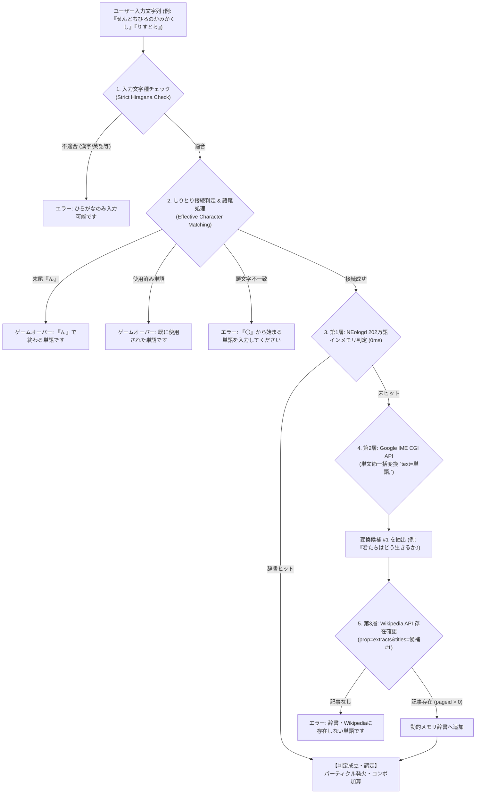

# ShiritoRush - 言葉の整合性アルゴリズム 仕様書

**作成日時**: 2026-07-28  
**対象コンポーネント**: `assets/js/game.js`, `api/validate_word.php`  
**テーマ**: 単語入力の正規化、しりとり接続ルール、および 4層ハイブリッド辞書判定アルゴリズムの詳細設計

---

## 1. アルゴリズム全体のフロー

---

## 2. アルゴリズムの各フェーズ詳細

### フェーズ 1: 入力文字正規化 ＆ バリデーション
1. **厳格ひらがなチェック (`isHiraganaOnly`)**:
   - 正規表現: `/^[ぁ-んー]+$/`
   - 全角ひらがなおよび長音記号「ー」のみを許容。
2. **小文字 ➔ 大文字正規化 (`smallToBigMap`)**:
   - 語尾および頭文字の接続比較において、捨て仮名（「ぁ」「ぃ」「ぅ」「ぇ」「ぉ」「っ」「ゃ」「ゅ」「ょ」「ゎ」）を自動的に大文字（「あ」「い」「う」「え」「お」「つ」「や」「ゆ」「よ」「わ」）へ変換して比較。
3. **長音記号「ー」の末尾処理 (`getEffectiveEndChar`)**:
   - 単語が長音「ー」で終わる場合（例: `らーめん` ➔ `ん` で終了 / `りーち` ➔ `ち` が有効語尾）、末尾から2文字目の文字を有効語尾として判定。

---

### フェーズ 2: しりとり規則判定 (ゲームルール検証)
1. **頭文字・語尾接続照合**:
   - 直前単語の有効語尾 `prevEndChar` と提出単語の有効頭文字 `inputStartChar` が一致するか検証。
2. **末尾「ん」判定**:
   - 有効語尾が「ん」の場合、即座にゲームオーバーフラグを発火し `triggerGameOver` を呼出。
3. **重複単語判定**:
   - `Set` 構造（`usedWordsSet`）を用いて、ゲーム開始以降に使用された単語と重複していないか検証。

---

### フェーズ 3: 第1層・202万語 NEologd 0ms メモリ照合
- **参照データ**: `data/neologd_dictionary.json` (2,021,390 件)
- **処理内容**:
  - アプリ起動時に非同期ロードされたハッシュマップ（`neologdMasterDict`）を `0.001ms` でキー検索。
  - 名詞、外来語（リストラ、ランドセル、リーチ、ラッパ）、映画タイトル、アニメ名が即座にヒット。

---

### フェーズ 4: 第2層・Google IME API ＋ Wikipedia API ハイブリッドフォールバック
NEologd 辞書に未登録の新語・マニアックな作品名に対する自動認定処理。

1. **Google IME CGI API リクエスト (単文節一括変換)**:
   - 公式仕様: `https://www.google.co.jp/ime/cgiapi.html` に基づき、単語末尾にカンマ `,` を付与してリクエスト。
   - エンドポイント: `https://www.google.com/transliterate?langpair=ja-Hira|ja&text={encodeURIComponent(hiraWord + ',')}`
   - 返却された JSON 配列から **1つ目の変換候補 (`segment[1][0]`)** を結合・抽出。
2. **Wikipedia API 存在確認**:
   - エンドポイント: `https://ja.wikipedia.org/w/api.php?action=query&format=json&prop=extracts&titles={候補#1}&formatversion=2&exintro=1&explaintext=1`
   - レスポンス内の `pageid > 0` かつ `missing` プロパティが存在しない場合、実在する事象・映画タイトルと認定。
3. **動的キャッシュ追加**:
   - 認定成功時、その単語とタイトル表記をメモリ上の `neologdMasterDict` へ即座に追加し、同セッションでの再判定を 0ms 化。
